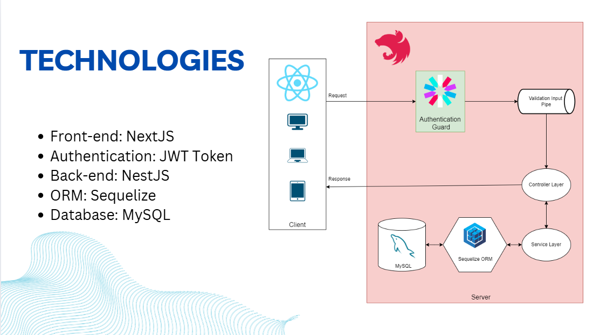

# Printing Management System

## Functional Requirements

### For Students:
1. **Upload Files**: Upload files for printing.
2. **Select Printer**: Choose a printer for the job.
3. **Set Print Properties**: 
   - Paper size
   - Number of pages to print
   - Print orientation (portrait/landscape)
   - Number of copies
4. **View Printing History**: 
   - History includes the number of pages and paper sizes printed.
   - Printing history is stored for a specific period.
5. **Purchase Additional Pages**: Buy more printing pages through the system.
6. **Online Payment**: Pay using an online payment service.
7. **HCMUT_SSO Authentication**: Register and log in using HCMUT_SSO authentication service.

### For Administrators:
1. **HCMUT_SSO Authentication**: Register and log in using HCMUT_SSO authentication service.
2. **View Printing History**: 
   - View the printing history of a specific student or all students.
   - View the printing history of a specific printer or all printers.
   - History is stored for a specific period.
3. **Printer Management**: 
   - Add a new printer.
   - Activate, deactivate, or remove a printer.

---

## Non-Functional Requirements

1. **Performance**: 
   - Support access for up to 500 concurrent users.
2. **Reliability**: 
   - Minimize system errors and ensure smooth operations.
3. **Availability**: 
   - Ensure printers are consistently available for use.
4. **Security**: 
   - Implement robust user authentication.
   - Prevent unauthorized access.
5. **Usability**: 
   - Provide a user-friendly interface for both students and administrators.

---

## Project Structure

- **Frontend**: User interface for interacting with the system.
- **Backend**: Manages authentication, print jobs, payment processing, and data storage.
- **Database**: Stores user data, printing history, and printer configurations.

---

### Use case

### System modeling

### Architectural design

### Technologies

---

## Contribution

- Fork the repository and create a feature branch.
- Submit a pull request with detailed changes.

---

## How to Run

1. **Install Dependencies**: Run `npm install` or equivalent for your environment.
2. **Setup Database**: Configure the database connection in the `.env` file.
3. **Start the Server**: Run `npm run start:dev` or equivalent command.
4. **Access the Application**: Open the provided URL in your browser.

---

## License

This project is licensed under the [MIT License](LICENSE).
